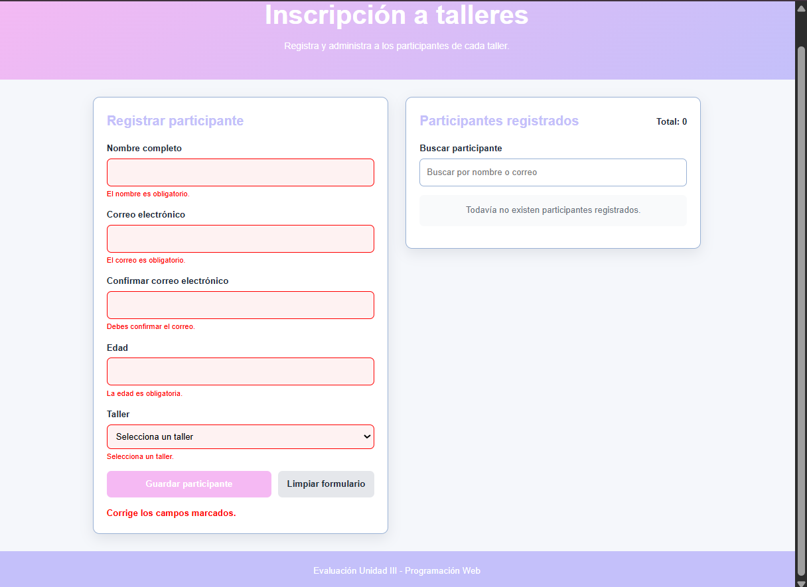
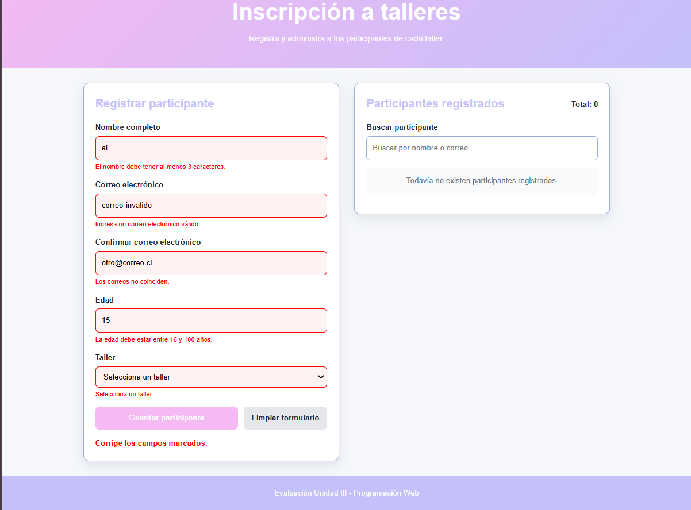
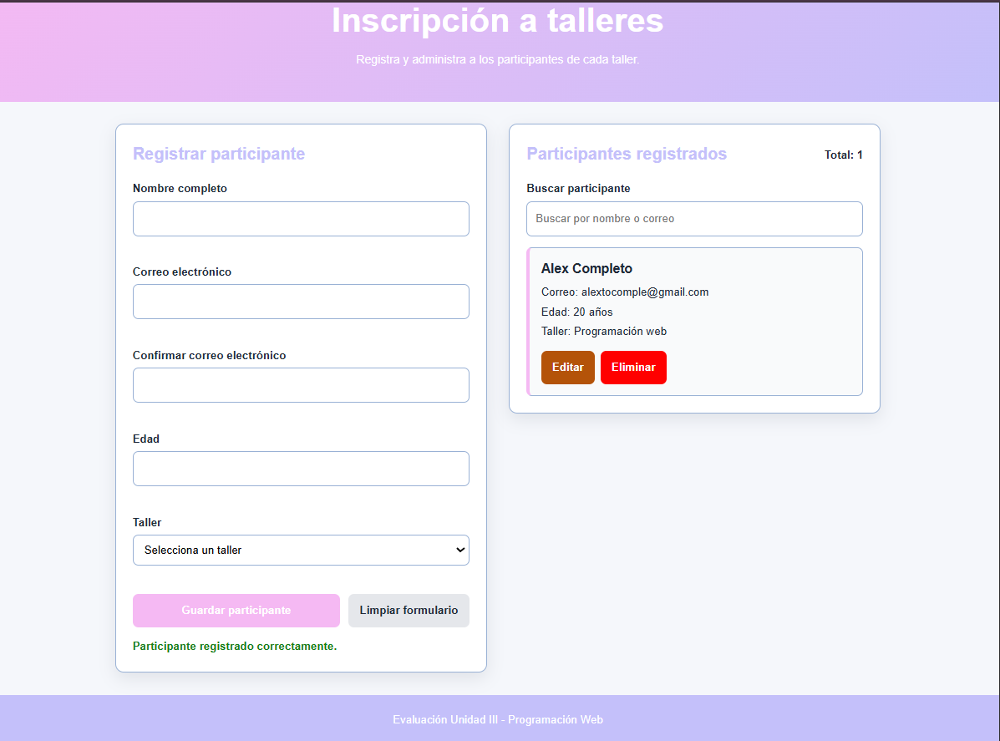
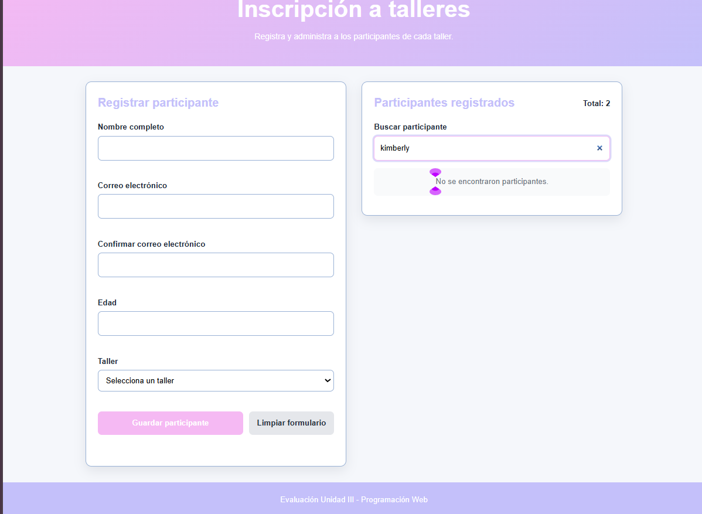
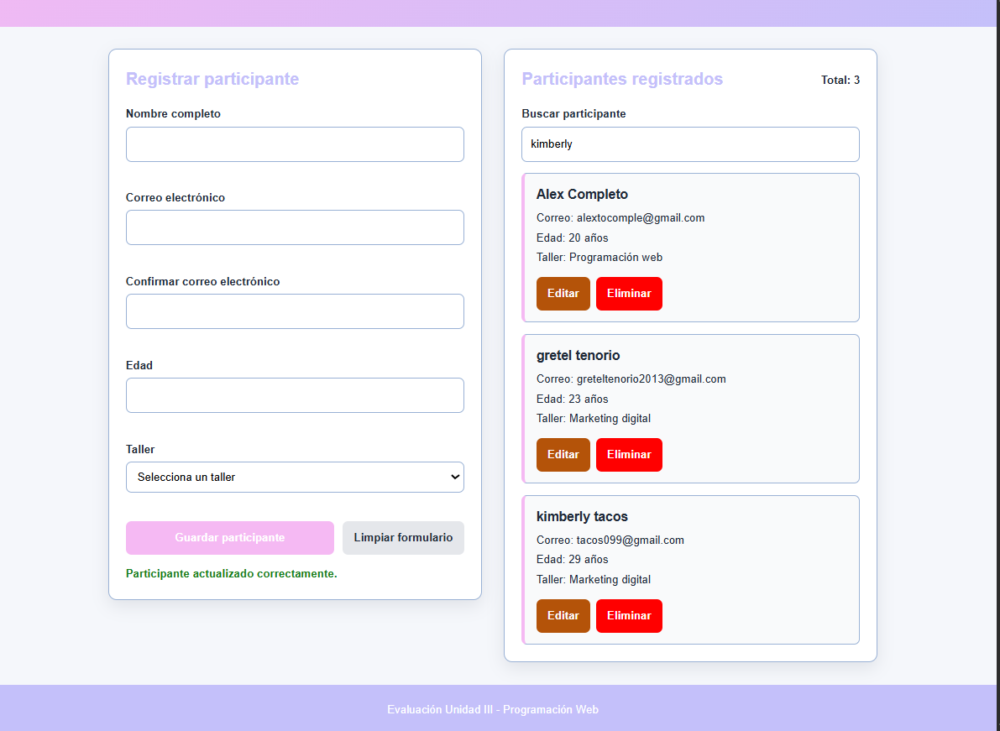
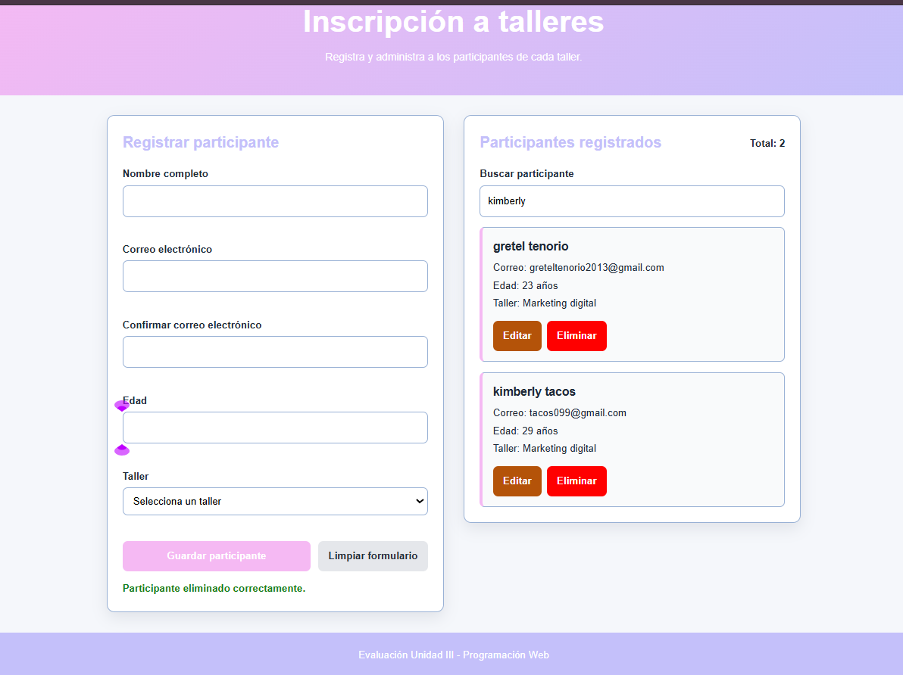
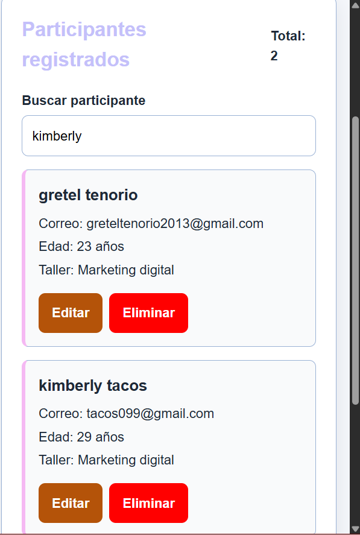

# Inscripción a talleres

Este proyecto corresponde a la Evaluación Final de la Unidad III de Programación Web.

La aplicación permite registrar participantes en diferentes talleres, guardar sus datos y administrarlos desde una sola página.

## Autora

Ignacia Mamani

## Objetivo

El objetivo del proyecto es aplicar los contenidos vistos en la unidad, principalmente la manipulación del DOM, los eventos, las validaciones de formularios y el almacenamiento de datos con LocalStorage.

## Tecnologías utilizadas

- HTML5 para la estructura.
- CSS3 para los estilos y el diseño responsive.
- JavaScript para las validaciones y la interacción.
- LocalStorage para guardar los participantes.
- Git y GitHub para controlar las versiones.

No es necesario instalar Node.js ni otras dependencias para ejecutar la aplicación.

## Funciones de la aplicación

- Registrar participantes.
- Validar los datos antes de guardarlos.
- Mostrar mensajes de error en cada campo.
- Evitar correos electrónicos duplicados.
- Guardar los participantes en LocalStorage.
- Recuperar los datos al recargar la página.
- Buscar participantes por nombre, correo o taller.
- Editar participantes registrados.
- Eliminar participantes.
- Mostrar el total de participantes.
- Adaptar la página a diferentes tamaños de pantalla.

## Validaciones implementadas

El formulario incluye las siguientes reglas:

1. Todos los campos son obligatorios.
2. El nombre debe tener al menos 3 caracteres.
3. El correo debe tener un formato válido.
4. Los dos correos deben coincidir.
5. La edad debe estar entre 16 y 100 años.
6. Se debe seleccionar un taller.
7. No se puede registrar dos veces el mismo correo.

## Eventos utilizados

- `submit`: valida y procesa el formulario.
- `click`: permite editar y eliminar participantes.
- `input`: actualiza los errores y realiza la búsqueda.
- `change`: detecta cambios en la selección del taller.

## Cómo ejecutar el proyecto

1. Descargar o clonar este repositorio.
2. Abrir la carpeta del proyecto.
3. Abrir el archivo `index.html` en Brave, Chrome, Edge o Firefox.

La aplicación funciona directamente en el navegador.

## Estructura del proyecto

```text
EvaluacionUnidad3-IgnaciaMamani/
├── css/
│   └── styles.css
├── js/
│   └── app.js
├── evidencias/
├── index.html
└── README.md
```

## Requisitos cumplidos

| Requisito | Forma en que se cumplió |
|---|---|
| Separación de responsabilidades | Se utilizaron archivos separados para HTML, CSS y JavaScript |
| Manipulación del DOM | Se modifican textos, clases y elementos desde JavaScript |
| Tres o más eventos | Se utilizaron `submit`, `click`, `input` y `change` |
| Elementos dinámicos | Las tarjetas se crean con `createElement` y `append` |
| Formulario de cuatro o más campos | El formulario tiene cinco campos |
| Cinco o más validaciones | Se implementaron siete reglas |
| Prevención del envío con errores | Se utilizó `preventDefault()` |
| Persistencia de datos | Los datos se guardan y recuperan con LocalStorage |
| Diseño responsive | Se utilizaron media queries |
| Git y GitHub | El proyecto cuenta con commits por cada avance |

## Evidencias

### Validaciones obligatorias



### Validaciones de formato, longitud, coincidencia y edad



### Registro y almacenamiento



### Prevención de correo duplicado


### Búsqueda de participantes



### Edición de participantes



### Eliminación de participantes



### Prueba en Brave


### Diseño responsive



## Preguntas de cierre

### 1. ¿Qué validación fue la más compleja y cómo la resolviste?

La validación más compleja fue comprobar que los correos coincidieran y que no se repitiera un correo que ya estaba registrado. Lo resolví comparando los valores ingresados y revisando el arreglo de participantes antes de guardar.

### 2. ¿Qué parte del DOM te permitió mejorar más la experiencia de usuario?

La creación dinámica de las tarjetas ayudó bastante, porque permite ver inmediatamente los participantes registrados. También fue útil modificar las clases de los campos para mostrar los errores de forma visual.

### 3. Si tuvieras dos horas más, ¿qué mejora implementarías y por qué?

Agregaría un filtro para ordenar a los participantes por taller y una opción para exportar la lista. Esto ayudaría a organizar mejor los datos cuando existan muchos participantes.

## Repositorio

[Ver proyecto en GitHub](https://github.com/IgnaciaMamani/EvaluacionUnidad3-IgnaciaMamani)
